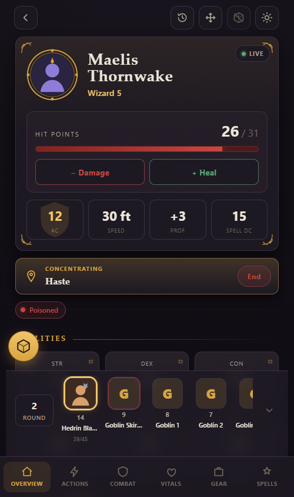
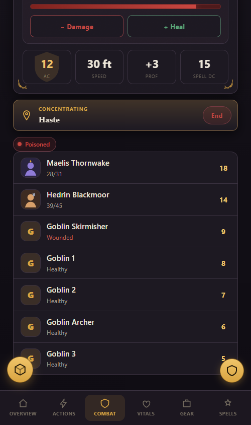
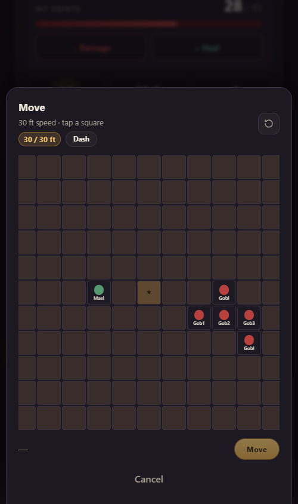
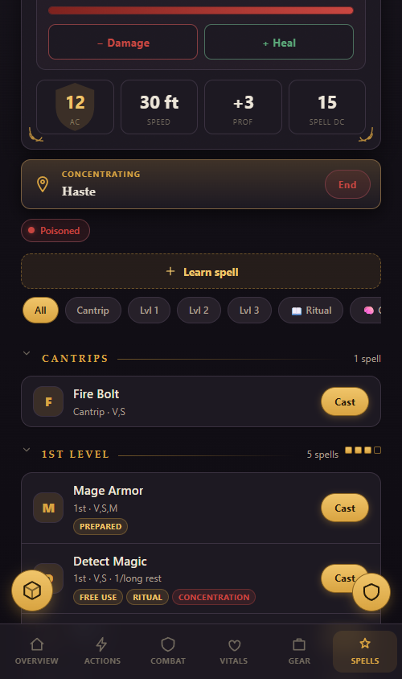
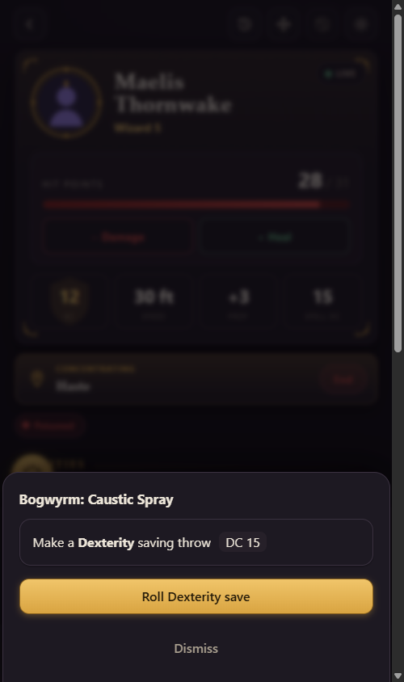
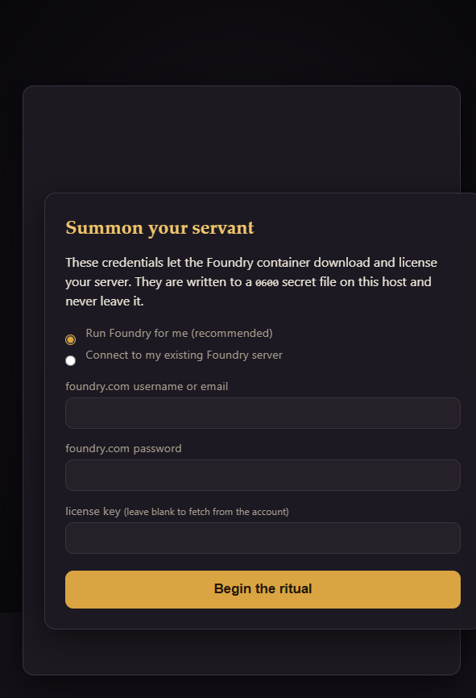

# Unseen Servant

A mobile-first companion app for [Foundry VTT](https://foundryvtt.com):
players manage their characters — rolls, spells, inventory, combat — from
their phone while the GM runs the table in Foundry. Currently supports
D&D 5e (best supported), Mörk Borg, and Vampire: the Masquerade 5e.

Free to use. The app itself is closed-source; this repo contains the
installer and deployment files.

## See it

A one-tap join link drops each player onto their own character — no Foundry
account, no app install, no app store. Everything writes back to Foundry live.

| Character overview | Combat & turn order | Move your token |
|---|---|---|
|  |  |  |

| Spellbook | GM-requested saves | One-time setup wizard |
|---|---|---|
|  |  |  |

**Full picture tour of every screen: [`WALKTHROUGH.md`](WALKTHROUGH.md).**

## What you get

One `docker compose` stack: Foundry VTT (bring your own license), the
[foundryvtt-rest-api relay](https://github.com/ThreeHats/foundryvtt-rest-api-relay),
the companion gateway + web app, and a bootstrap sidecar that wires
everything together automatically (module install, relay pairing key).

Already running Foundry somewhere? The setup wizard can connect to an
existing instance instead of running the bundled one — see
[the guide](GUIDE.md#2b-connect-an-existing-foundry-bring-your-own).

## Requirements

- Docker with Compose v2, or rootless Podman with podman-compose
- Node.js 22+ (runs the setup wizard and updates)
- A Foundry VTT license (foundryvtt.com account)

**New here? The [step-by-step setup guide](GUIDE.md) covers everything from
empty server to playing on your phone — including the pairing flow and
troubleshooting.**

## Install

```bash
git clone https://github.com/Tenezill/unseen-servant.git
cd unseen-servant
make setup
```

The wizard asks for your foundryvtt.com credentials (used once by the
Foundry container to fetch its release), generates all other secrets, writes
them to `./secrets/` (mode 0600), and starts the stack. Its first question lets
you connect an existing Foundry instance instead — see
[the guide](GUIDE.md#2b-connect-an-existing-foundry-bring-your-own) for that workflow.

Afterwards:

- Web app: http://localhost:8080
- Foundry: http://localhost:30000
- Relay: http://localhost:3010

Ports are configurable in the generated `.env`.

## Update

```bash
make update
```

Data-safe by construction: pulls new pinned image versions and recreates only
changed containers. Never touches your world data, players, secrets, or
relay DB (all live in bind-mount folders next to this file).

## TLS / remote access

Re-run `make setup` and answer the TLS prompts, or see the comments in
`Caddyfile.tls.example`. Rootless Podman note: binding ports 80/443 needs
`sysctl net.ipv4.ip_unprivileged_port_start=80`.

## License

Everything here is free to use, including commercially (e.g. paid game
sessions) — but nothing may be resold. The deployment files in this repo are
covered by the [Deployment Files License](LICENSE); the app's container
images (`ghcr.io/tenezill/unseen-servant-*`) by their EULA (no
redistribution/resale; see `/licence/EULA.md` inside each image, along with
third-party attributions). Foundry VTT and the relay are separate projects
under their own terms.

## Trademarks & game content

Unseen Servant is an independent, unofficial companion app. It is **not
affiliated with, endorsed, or sponsored by** Wizards of the Coast, Paradox
Interactive, Renegade Game Studios, Foundry Gaming, or any other game publisher.
*Dungeons & Dragons*, *Vampire: The Masquerade*, *Mörk Borg*, *Foundry Virtual
Tabletop* and related marks belong to their respective owners, and are used here
only to say which systems the app works with.

The app ships **no game content** — no rulebooks, compendia, stat blocks or
spell text. It reads your characters live from your own Foundry instance, so the
only rules content involved is the content already in your world. Full notices
and SRD 5.1 attribution: [`GAME-CONTENT.md`](GAME-CONTENT.md) (also at
`/licence/GAME-CONTENT.md` inside each image).

## Issues

Bug reports and feature requests welcome — open an issue here.
