# Visual walkthrough — Foundry's Unseen Servant

A picture tour of what you actually get: the turnkey installer, pairing Foundry
to the relay, the admin console, and the mobile player app in play.

Every player-app shot is a **real phone-sized screen** — the app is mobile-first
and this is what your players will hold. Both built-in themes are shown: the
dark "Gilded Tome" and a light parchment variant.

> **About the characters shown.** These are demo characters from the project's
> development fixtures — *Maelis Thornwake* (Wizard 5) and *Hedrin Blackmoor*
> (Fighter 5). All descriptive text in these screenshots is invented for this
> project. No rulebook content is reproduced here.

---

## 1. Setup — one command

`make setup` runs a one-time, self-hosted web wizard (it dies with the CLI, so
the token and secrets can't linger). It generates every secret for you, shows
them **once**, then brings the whole stack up.

### Two ways to run it

The very first control on the form is the fork — you are not pushed into a
bundled Foundry. Picking a mode swaps the fields below it:

| Run Foundry for me | Connect my existing Foundry |
|---|---|
|  | 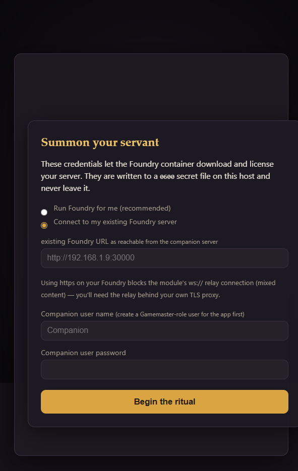 |

- **Run Foundry for me** — the stack brings up its own Foundry container,
  installs the D&D 5e system and the REST module, and launches the world for
  you. It asks only for your foundryvtt.com login so the container can download
  and license itself. Nothing else to set up by hand.
- **Connect my existing Foundry** — you already run Foundry (a hosted instance,
  a NAS, another machine). No Foundry container is started at all. Instead it
  asks for your Foundry's URL *as reachable from the companion server*, plus a
  dedicated Gamemaster-role user for the app to log in as. You install one
  module; everything else is unchanged.

*Note the warning in the right-hand shot: if your existing Foundry is behind
HTTPS, the module's `ws://` relay connection is blocked as mixed content, so the
relay needs to sit behind your own TLS proxy. The guide covers this.*

### Then it hands you your secrets, once

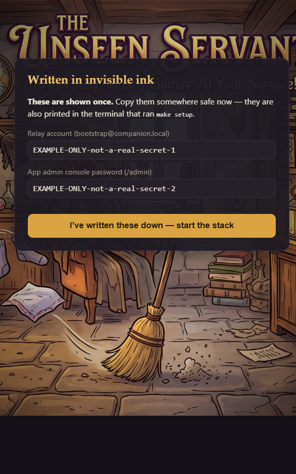

Credentials you typed are written to a `0600` file on your host and never leave
it. The generated secrets are shown on this page exactly once — they are also
printed in the terminal that ran `make setup`.

*The values above are obvious placeholders, not real secrets.*

---

## 2. Pairing Foundry to the relay

Inside Foundry, the **REST API Connection** module links your world to the relay
with a single **Pair** click. Once paired it stays connected and shows live
status — this is the bridge the app talks to.

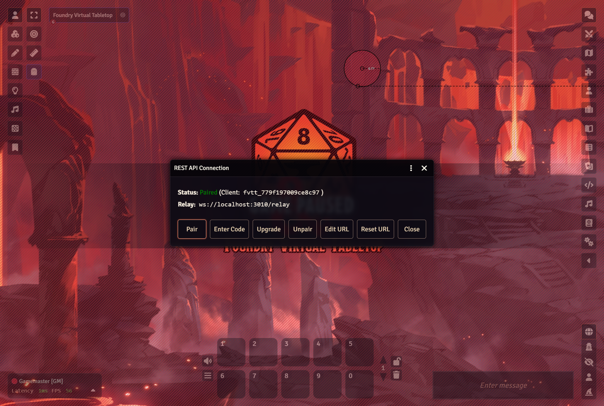

*Status: **Paired**. The admin console shows you the exact `ws://` URL to paste.*

---

## 3. Admin console — player links

The self-hosted admin console is where you mint one-tap join links per player,
scope each to specific characters, and revoke them.

| Admin login | Player links | Relay & pairing |
|---|---|---|
| 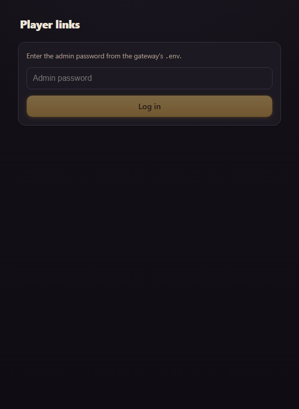 | 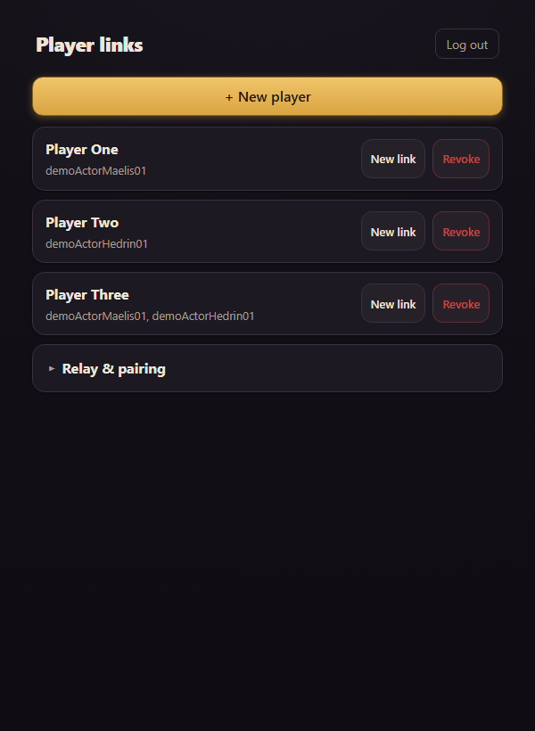 | 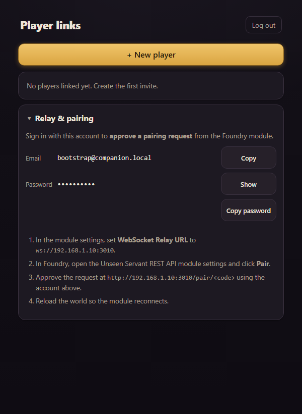 |

Each player is bound to one or more Foundry actors — *Player Three* above is
scoped to two. **New link** rotates their invite, **Revoke** kills it. Links
survive restarts.

The **Relay & pairing** panel is the part that saves you a support call. It hands
you the relay account to approve pairing with, and the exact
`ws://<your-host>:3010` URL to paste into the module — no assembling it by hand,
no guessing whether it should be your Foundry's address or this machine's. The
password stays masked until you ask for it.

---

## 4. The player app

A player taps their invite link once and lands on their character — no Foundry
account, no app install, no app store. Everything writes straight back into
Foundry, live. Note the **LIVE** badge: that is a real-time connection, not
polling.

### Picking a character

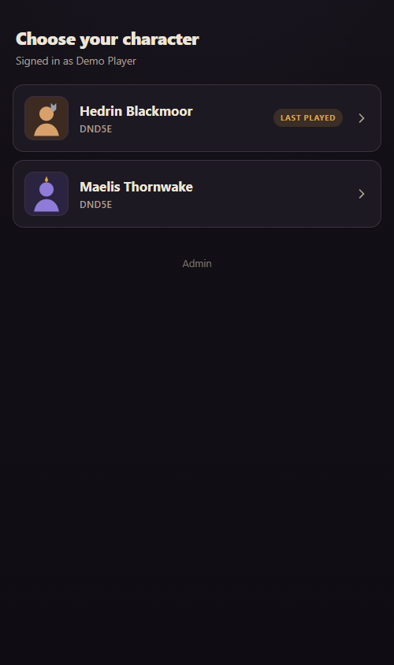

*A player sees only the characters you scoped to their link.*

### Overview

The header carries HP with **Damage/Heal**, AC, speed, proficiency and spell DC.
Below sit abilities, saving throws, skills and features — each tappable to roll.

Two things worth pointing out in that shot: the **concentration banner** (with a
one-tap *End*), and the **condition badge**. Conditions applied in Foundry show
up here immediately, and buffs cast from the app apply back the other way.

### Actions — everything you can do this turn

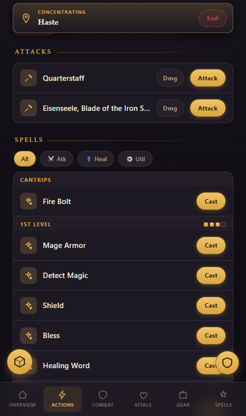

Weapon **Attack**/**Dmg**, spells filtered by **Atk / Heal / Util**, and class
features with a **Use** button. The pip row on a spell level (`▪▪▪▫`) is your
remaining slots at a glance.

Versatile weapons carry a one-handed / two-handed grip toggle, and the attack
line updates to the die you will actually roll.

### Combat — turn order

When the GM starts an encounter the app follows along. Your party's exact HP is
visible; monsters deliberately show only a **health tier** (*Healthy*,
*Wounded*, *Bloodied*) so the app never leaks numbers the GM has not shared.
An unlinked monster whose maximum HP isn't known to the app shows *Alive*
instead, and flips to *Down* the moment it drops.

A floating turn-order carousel rides above every tab so you always know who is
up. It collapses to a pill when it is in the way, and auto-expands on your turn
with an **End turn** button.

### Movement — move your token from your phone

Tap a square, tap **Move**. The grid shows your remaining movement budget
(`30 / 30 ft`), greys out squares you can no longer reach, and offers **Dash**
when you need it. Out of combat your whole speed is available; in combat the
budget shrinks as you spend it, and the grid refuses to move you on someone
else's turn.

Other tokens show as coloured dots — green for allies, red for hostiles — each
with a short name label. That labelling matters more than it looks: a
four-square dragon and four goblins standing together are otherwise the same
four red dots. Here `Gob1`, `Gob2` and `Gob3` are clearly three separate
goblins, while the two `Gobl` dots are the two whose names genuinely share a
prefix. Hover or long-press any dot for the full name.

### Saving throws the GM asks for

When something in Foundry calls for a save, the players it targets get prompted
on their own phone — ability and DC already filled in. One tap rolls it as their
character into the shared chat log. No more "everyone roll a Dex save… no, *you*
too."

### Vitals — HP, slots, hit dice & rest

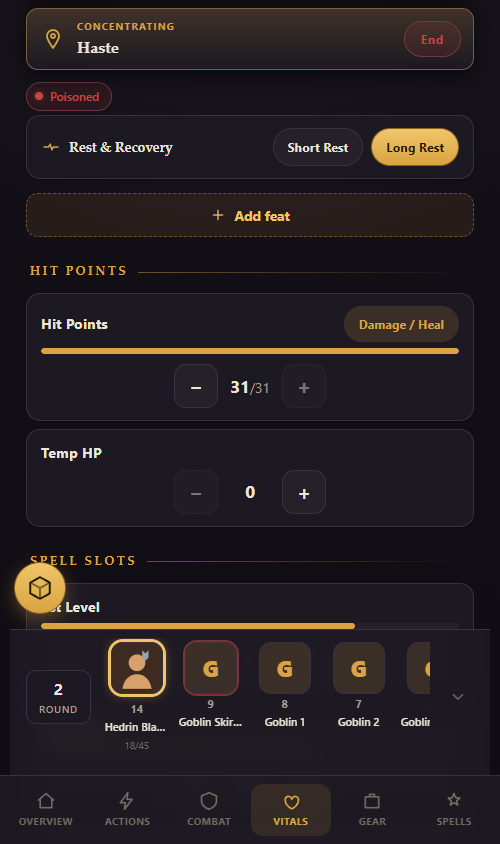

Short and long rest, HP and temp-HP steppers, hit dice, inspiration, exhaustion
and per-level spell slots — all editable, all synced.

### Gear

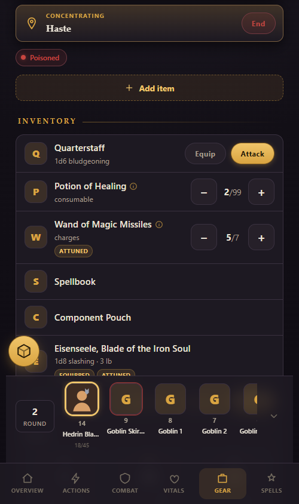

Quantities with steppers, charge tracking, **Equipped** and **Attuned** badges
with working toggles, and containers that roll their contents' weight up.

### Spells

Filter by level, ritual or concentration. **Prepared** spells sort to the top and
unprepared ones dim, with a running prepared count against your budget. Casting
spends the right slot — and if you cast from a higher one, upcasting is offered
rather than assumed.

### Rolling

| Dice tray | Light theme |
|---|---|
| 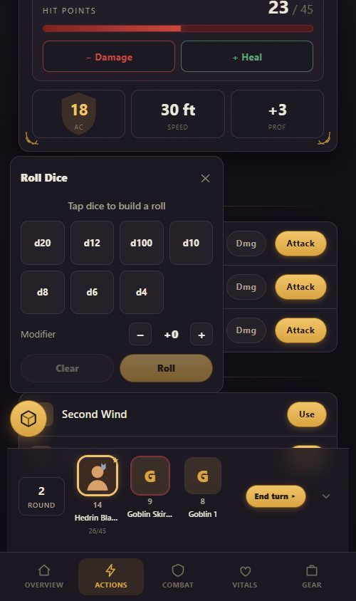 | 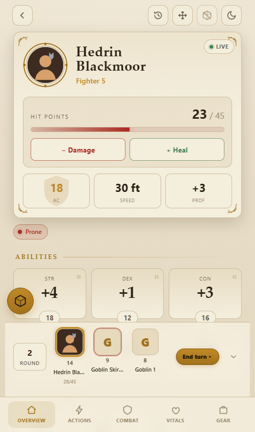 |

Every roll runs **in Foundry, as your character**, and lands in the shared chat
log — so the GM sees it exactly as if it had been rolled at the table. Tap any
roll for normal / advantage / disadvantage. The dice tray handles freeform rolls,
and roll history keeps the session's results.

---

*Captured against Foundry VTT 14.364 + dnd5e 5.3.3 with the ThreeHats REST relay
3.4.1. See [`GUIDE.md`](GUIDE.md) for setup and [`README.md`](README.md) for the
architecture.*
